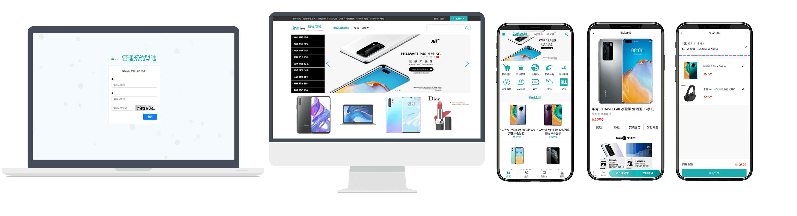
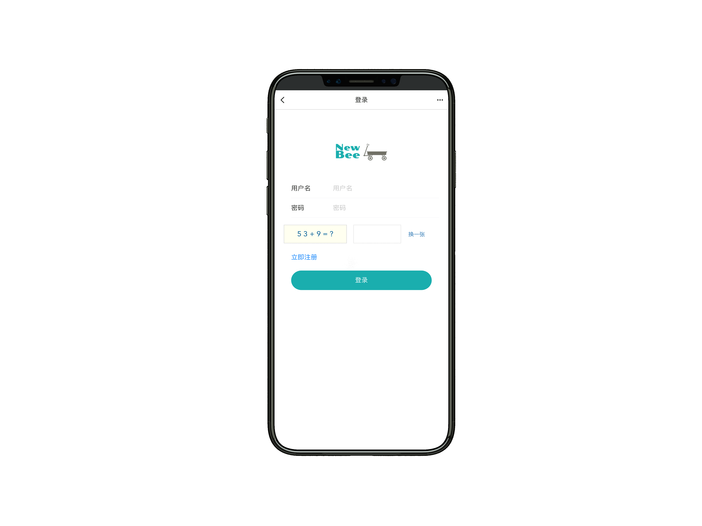
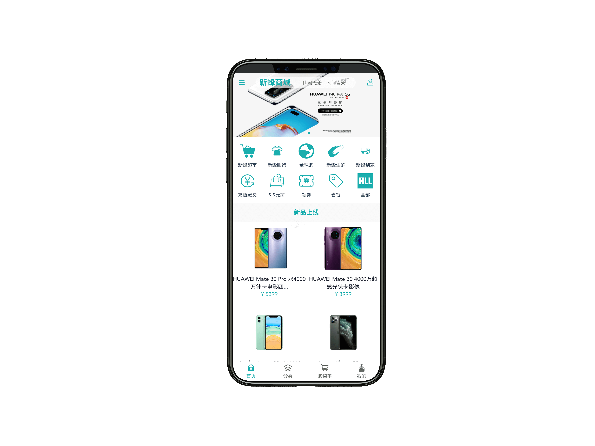
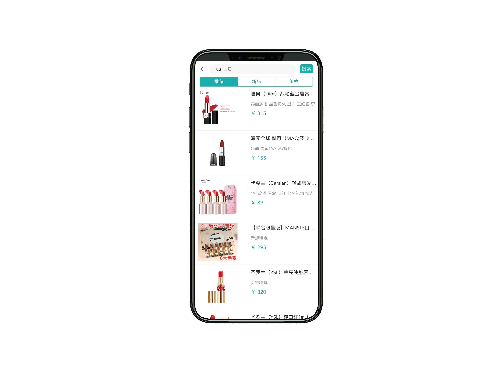
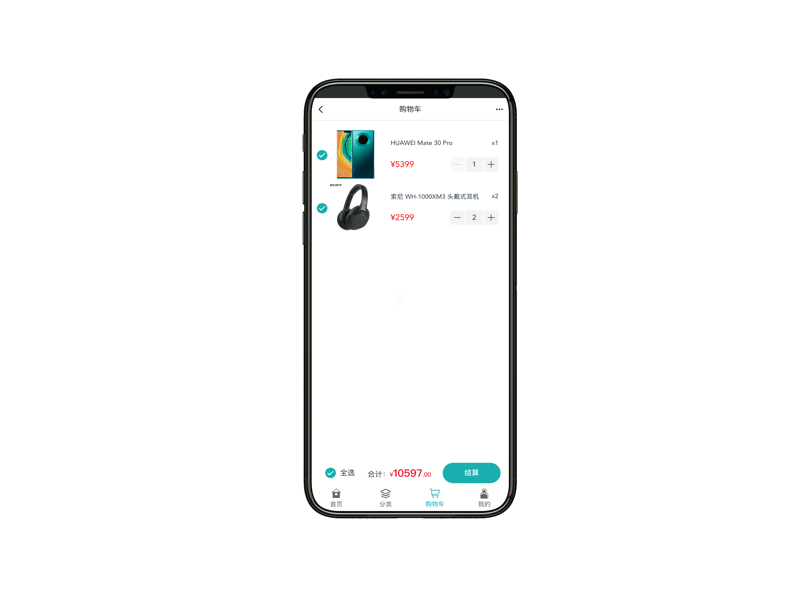
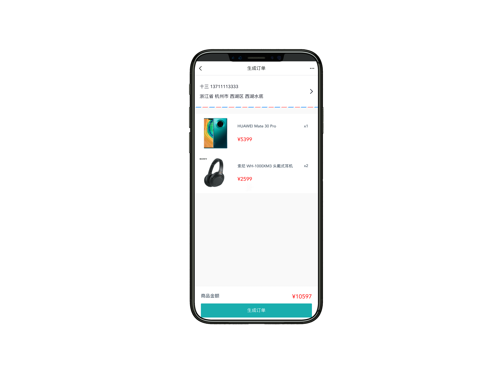
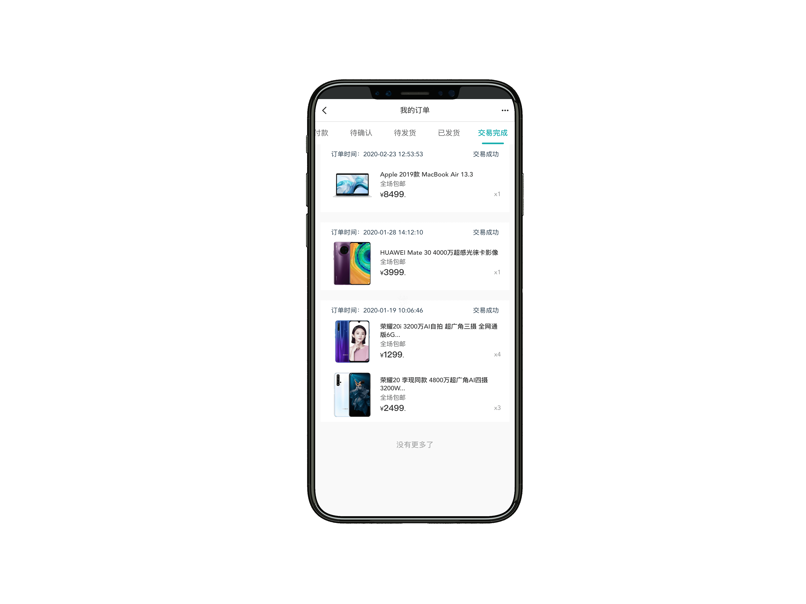
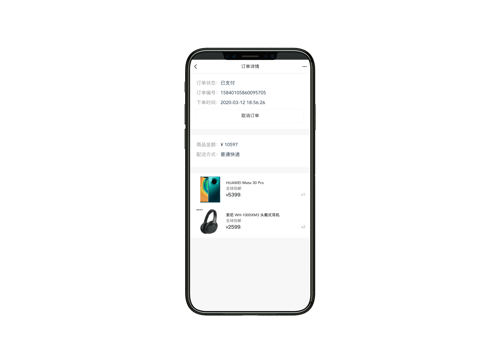

newbee-mall 项目是一套电商系统，包括 newbee-mall 商城系统及 newbee-mall-admin 商城后台管理系统，基于 Spring Boot 2.X 及相关技术栈开发。 前台商城系统包含首页门户、商品分类、新品上线、首页轮播、商品推荐、商品搜索、商品展示、购物车、订单结算、订单流程、个人订单管理、会员中心、帮助中心等模块。 后台管理系统包含数据面板、轮播图管理、商品管理、订单管理、会员管理、分类管理、设置等模块。

本仓库中的源码为新蜂商城前后端分离版本的 Vue 项目，主要面向前端开发人员，后端 API 源码在另外一个仓库 [newbee-mall-api](https://github.com/newbee-ltd/newbee-mall-api)。

前后端分离版本包括三个仓库：

- [新蜂商城 V2 后端接口 newbee-mall-api](https://github.com/newbee-ltd/newbee-mall-api)
- [新蜂商城 V2 前端页面 newbee-mall-vue-app](https://github.com/newbee-ltd/newbee-mall-vue-app)
- [新蜂商城 V2 后台管理系统 newbee-mall-manage](https://github.com/newbee-ltd/newbee-mall-manage)

>与新蜂商城第一个版有所区别，希望大家不要混淆。

**坚持不易，如果觉得项目还不错的话可以给项目一个 Star 吧，也是对我一直更新代码的一种鼓励啦，谢谢各位的支持。**

关注公众号：**程序员的小故事**，回复"勾搭"进群交流。

## 开发及部署文档

- [Spring Boot+Vue前后端分离商城实战（一）后端API项目基础环境搭建](https://blog.csdn.net/zhenfengshisan/category_10054411.html?event_id=1047&event_type=fission&share_username=ZHENFENGSHISAN&sign=692e802a4e885ea31adb8b0ab4b36b61)
- [Spring Boot+Vue前后端分离商城实战（二）Spring Boot 项目构建及使用](https://blog.csdn.net/zhenfengshisan/category_10054411.html?event_id=1047&event_type=fission&share_username=ZHENFENGSHISAN&sign=692e802a4e885ea31adb8b0ab4b36b61)
- [Spring Boot+Vue前后端分离商城实战（三）Spring Boot 整合 MyBatis](https://blog.csdn.net/zhenfengshisan/category_10054411.html?event_id=1047&event_type=fission&share_username=ZHENFENGSHISAN&sign=692e802a4e885ea31adb8b0ab4b36b61)
- [Spring Boot+Vue前后端分离商城实战（四）Spring Boot 整合 Lombok](https://blog.csdn.net/zhenfengshisan/category_10054411.html?event_id=1047&event_type=fission&share_username=ZHENFENGSHISAN&sign=692e802a4e885ea31adb8b0ab4b36b61)
- [Spring Boot+Vue前后端分离商城实战（五）Spring Boot 整合 Swagger](https://blog.csdn.net/zhenfengshisan/category_10054411.html?event_id=1047&event_type=fission&share_username=ZHENFENGSHISAN&sign=692e802a4e885ea31adb8b0ab4b36b61)
- [Spring Boot+Vue前后端分离商城实战（六）后端 API 项目启动和运行注意事项](https://blog.csdn.net/zhenfengshisan/category_10054411.html?event_id=1047&event_type=fission&share_username=ZHENFENGSHISAN&sign=692e802a4e885ea31adb8b0ab4b36b61)
- [Spring Boot+Vue前后端分离商城实战（七）前端开发之 VSCode 编辑器](https://blog.csdn.net/zhenfengshisan/category_10054411.html?event_id=1047&event_type=fission&share_username=ZHENFENGSHISAN&sign=692e802a4e885ea31adb8b0ab4b36b61)
- [Spring Boot+Vue前后端分离商城实战（八）Vue 指令介绍](https://blog.csdn.net/zhenfengshisan/category_10054411.html?event_id=1047&event_type=fission&share_username=ZHENFENGSHISAN&sign=692e802a4e885ea31adb8b0ab4b36b61)
- [Spring Boot+Vue前后端分离商城实战（九）Vue 全局 API](https://blog.csdn.net/zhenfengshisan/category_10054411.html?event_id=1047&event_type=fission&share_username=ZHENFENGSHISAN&sign=692e802a4e885ea31adb8b0ab4b36b61)
- [Spring Boot+Vue前后端分离商城实战（十）脚手架工具 Vue-CLI](https://blog.csdn.net/zhenfengshisan/category_10054411.html?event_id=1047&event_type=fission&share_username=ZHENFENGSHISAN&sign=692e802a4e885ea31adb8b0ab4b36b61)
- [Spring Boot+Vue前后端分离商城实战（十一）CSS 预处理器 Less](https://blog.csdn.net/zhenfengshisan/category_10054411.html?event_id=1047&event_type=fission&share_username=ZHENFENGSHISAN&sign=692e802a4e885ea31adb8b0ab4b36b61)
- [Spring Boot+Vue前后端分离商城实战（十二）Vue 前端路由介绍](https://blog.csdn.net/zhenfengshisan/category_10054411.html?event_id=1047&event_type=fission&share_username=ZHENFENGSHISAN&sign=692e802a4e885ea31adb8b0ab4b36b61)
- [Spring Boot+Vue前后端分离商城实战（十三）状态管理之 Vuex](https://blog.csdn.net/zhenfengshisan/category_10054411.html?event_id=1047&event_type=fission&share_username=ZHENFENGSHISAN&sign=692e802a4e885ea31adb8b0ab4b36b61)
- [Spring Boot+Vue前后端分离商城实战（十四）Vue 商城端项目启动及注意事项](https://blog.csdn.net/zhenfengshisan/category_10054411.html?event_id=1047&event_type=fission&share_username=ZHENFENGSHISAN&sign=692e802a4e885ea31adb8b0ab4b36b61)
- [Spring Boot+Vue前后端分离商城实战（十五）常见问题总结](https://blog.csdn.net/zhenfengshisan/category_10054411.html?event_id=1047&event_type=fission&share_username=ZHENFENGSHISAN&sign=692e802a4e885ea31adb8b0ab4b36b61)

## 联系作者

> 大家有任何问题或者建议都可以在 [issues](https://github.com/newbee-ltd/newbee-mall-vue-app/issues) 中反馈给我，我会慢慢完善这个项目。

- 我的邮箱：2449207463@qq.com
- QQ技术交流群：753510786 719099151 796794009

## 软件著作权

>本系统已申请软件著作权，受国家版权局知识产权以及国家计算机软件著作权保护！

## 页面展示

以下为新蜂商城 Vue 版本的页面预览：

- 登录页

- 首页

- 商品搜索

- 商品详情页

- 购物车

- 生成订单

- 地址管理

- 订单列表

- 订单详情

## 感谢

- [Vue](https://github.com/vuejs/vue)
- [Vant](https://github.com/youzan/vant)
- [vue2-verify](https://github.com/mizuka-wu/vue2-verify)
- [better-scroll](https://github.com/ustbhuangyi/better-scroll)
- [Vuex](https://github.com/vuejs/vuex)

